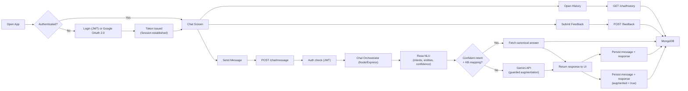

# Authentication and History/Feedback Workflow

```mermaid
flowchart LR
  A["Open App"] --> B{"Authenticated?"}
  B -- "No" --> C["Login (JWT) or Google OAuth 2.0"]
  C --> D["Token issued<br/>(Session established)"]
  B -- "Yes" --> E["Chat Screen"]
  D --> E

  E --> F["Send Message"]
  E --> G["Open History"]
  E --> H["Submit Feedback"]

  G --> I["GET /chat/history"]
  I --> J["MongoDB"]

  H --> K["POST /feedback"]
  K --> J

  F --> L["POST /chat/message"]
  L --> M["Auth check (JWT)"]
  M --> N["Chat Orchestrator (Node/Express)"]
  N --> O["Rasa NLU<br/>(intents, entities, confidence)"]
  O --> P{"Confident intent<br/>+ KB mapping?"}

  P -- "Yes" --> Q["Fetch canonical answer"]
  Q --> J
  Q --> R["Return response to UI"]
  R --> S["Persist message + response"]
  S --> J

  P -- "No" --> T["Gemini API<br/>(guarded augmentation)"]
  T --> R
  R --> U["Persist message + response<br/>(augmented = true)"]
  U --> J
```